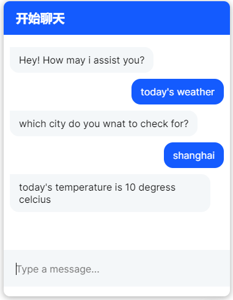

# hello-rasa
rasa入门学习, [代码的详细介绍](https://51fhd.com/dev/hello-rasa/)

**效果**



### 案例1：一个最简单的web聊天机器人

**组成**

1. rasa 核心
2. web 聊天页面

#### rasa核心

1. 参考官网[安装与初始化](https://rasa.com/docs/rasa/installation)：

```bash
rasa init
```

2. 在credential.yml中配置channel connector供web连接，参考官网[channel connectors](https://rasa.com/docs/rasa/connectors/your-own-website)

```yml
socketio:
  user_message_evt: user_uttered
  bot_message_evt: bot_uttered
  session_persistence: true
```

3. 运行 - 带允许跨域参数

```bash
rasa run --cors "*"
```

#### web聊天页面

1. 参考并依赖[bot-front](https://github.com/botfront/rasa-webchat)做一个html页面

### 案例2：获取天气聊天机器人

对话的大体目标，两个问句。第一次提出查天气，第二次说明具体的城市

```bash
hi
hi how may i assit you?

tell me today's weather?
which city you want to check for?

shanghai
the temperature is 27 degree
```

**组成**

1. rasa 核心
2. custom action - 获取天气
3. web 聊天页面

